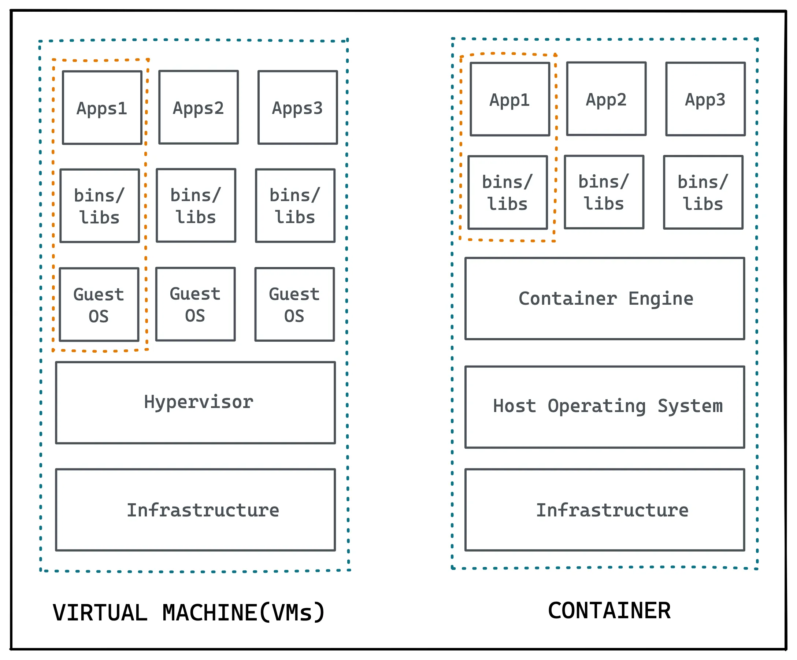

# Introduction to Docker
</img>

**Docker** is a containerization platform that allows developers to package their applications and dependencies into portable and self-contained units called containers. Docker provides an efficient and lightweight way to build, ship, and run applications across different environments, from development to production.
#
## Difference between Docker and Virtual Machines:

Docker containers and virtual machines (VMs) are both used to isolate applications and their dependencies, but they use different approaches to achieve this goal.

A VM is a software emulation of a physical computer that runs on top of a host operating system. Each VM has its own **virtual hardware**, including CPU, memory, and storage, and runs its own guest operating system and applications. VMs provide strong **isolation** between applications, but they also have significant **overhead** in terms of resource consumption, startup time, and maintenance.

A Docker container, on the other hand, is a **lightweight** and **portable** unit of software that runs on top of a host operating system and shares the kernel with other containers. Containers provide process-level isolation between applications, which means that each container runs in its own namespace and has its own file system, network interface, and process tree. Containers are faster, more efficient, and more scalable than VMs, as they can share resources and start up almost instantly.

</img>
* <u>Infrastructure</u> - The hardware of the host computer.
* <u>Hypervisor</u> - Software that allows multiple virtual machines to share a single physical host.
* <u>Container Engine</u> - The docker engine.

#
## Docker on Windows - wsl

Windows Subsystem for Linux (WSL) is needed to run Docker engine on Windows because Docker **requires** a Linux kernel to operate.

### If wsl is vm?
WSL is not a traditional virtual machine (VM) in the sense that it does not require a full system virtualization layer to operate. Instead, WSL uses a lightweight virtualization technology called a "translation layer" that allows it to translate Linux system calls to Windows system calls on-the-fly. This means that WSL can run Linux binaries directly on Windows, without requiring a full VM or containerization technology. <u>However, WSL can be thought of as a type of virtualization technology since it provides a separate and isolated environment for running Linux applications on Windows.</u>

#
[Next](./2.%20lifecycle.md)