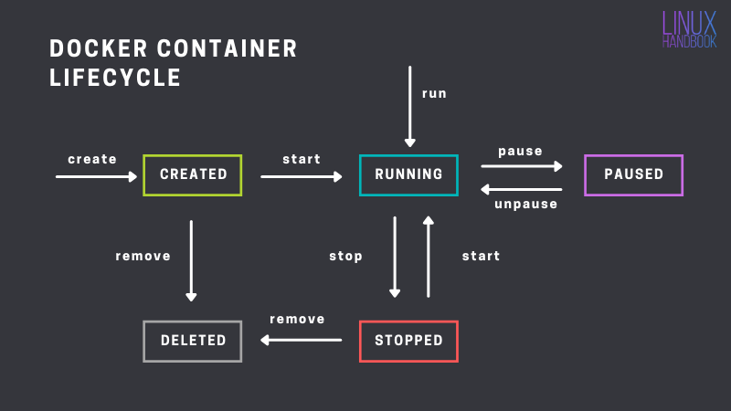

## Images, Containers Volumes and and what is in between:)
</img>

A Docker **Image** is a lightweight, standalone, and executable **package** that contains everything needed to run a piece of software, including code, libraries, dependencies, and runtime environment.

A **Container** is a **runnable instance** of an image. You can create, start, stop, move, or delete a container using the Docker API or CLI. You can connect a container to one or more networks, attach storage to it (**Volumes**), or even create a new image based on its current state.
#
## Docker Lifecycle

The lifecycle of a Docker container typically involves four stages: `creating`, `running`, `stopping`, and `removing`.

The first stage is **`creating`** a Docker container, which involves **building** an image from a Dockerfile or pulling an existing image from a Docker registry.

The second stage is **`running`** the container, which involves launching the container from the image and specifying any necessary configurations or settings.

The third stage is **`stopping`** the container, which can be done either by sending a termination signal or by using the Docker CLI to stop the container manually.

The fourth stage is **`pausing`** the container, which is not commonly used. This action temporarily suspends all processes inside the specified containers.

The final stage is **`removing`** the container, which involves deleting the container from the host system and any associated resources, such as network connections or storage volumes.

Throughout the lifecycle, Docker provides various tools and commands for managing containers, monitoring their performance, and troubleshooting any issues that may arise. By following this lifecycle, users can create, run, and manage Docker containers in a controlled and efficient manner, allowing them to deploy and scale applications quickly and reliably.

#
[Back](./1.%20intro.md) | [Next](./3.%20build.md)
