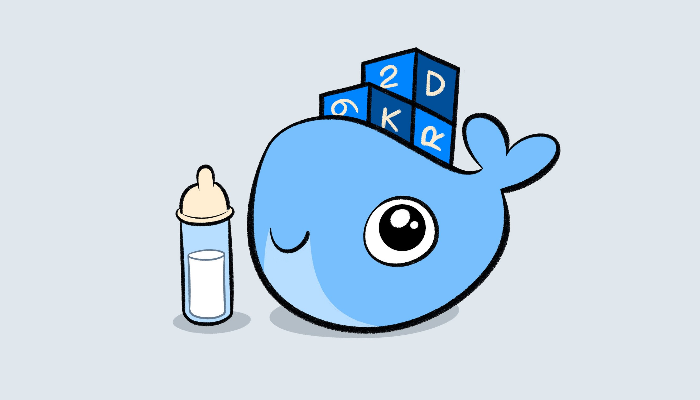
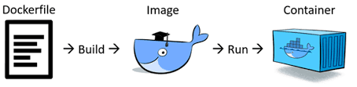

## Build - How a Container is born
</img>

Building a Docker image is the process of creating a custom image by specifying a set of instructions in a Dockerfile. A **Dockerfile** is a text file that contains a series of commands that are used to build the image from a base image, also known as the parent image. Each command in the Dockerfile creates a new layer in the image, which represents a change made to the file system. These layers are cached and reused by subsequent builds, which can greatly speed up the process of building and deploying applications.
<br>
</br>

#
## DockerHub - A Docker Registry
[DockerHub](https://hub.docker.com/search) is a cloud-based registry service provided by Docker for storing and distributing container images. It serves as a central repository for developers and system administrators to store, manage, and share Docker images.

When you want to build a new Docker image: If you are creating a new Docker image that is based on an existing image, you can pull the base image from a registry and use it as a starting point.

#
## exmple of a Dockerfile
```docker
# Set the base image to use
FROM python:3.8-slim-buster

# Set the working directory
WORKDIR /app

# Copy the requirements file into the container
COPY requirements.txt .

# Install the required Python packages
RUN pip install -r requirements.txt

# Copy the application code into the container
COPY . .

# Set the entrypoint to run the application
ENTRYPOINT [ "python" ]
# Add parameter to the executable python
CMD [ "app.py" ]
```
#
## ENTRYPOINT And CMD
When building Docker images, you can use the `ENTRYPOINT` and `CMD` instructions to define the default command to be executed when a container is launched/started.

`ENTRYPOINT` should be set as the executable, specifying the main command or process that runs within the container.

`CMD` should contain the parameters for the `ENTRYPOINT` or the default command if no `ENTRYPOINT` is specified.

Base images may already have their own `ENTRYPOINT` and `CMD` defined, but we can override them with our own instructions.

If the base image doesn't specify an `ENTRYPOINT`, the default executable will be `/bin/bash`.

In summary, `ENTRYPOINT` defines the executable, and `CMD` provides the parameters or default command. Base images may have their own instructions, but we can override them, and if no `ENTRYPOINT` is specified, `/bin/bash` becomes the default executable.

#
[Back](./2.%20lifecycle.md) | [Next](./4.%20networks.md)