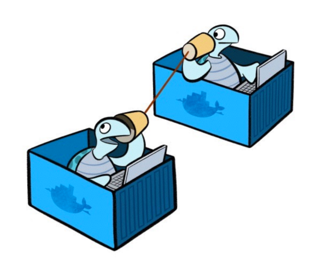
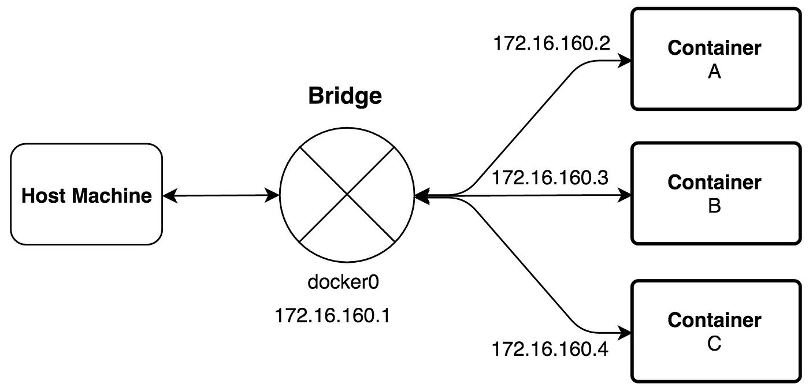
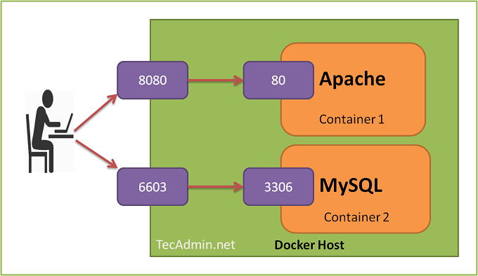

# Docker Networks
</img>

Docker networks are a way for Docker containers to communicate with each other and with the host machine. By default, Docker creates a bridge network for each Docker installation, which allows containers to communicate with each other through the bridge interface.
#

## Bridge Network Mode

In Docker, a bridge network is a private network created by the Docker Engine that allows containers to communicate with each other using the network. Each container connected to the bridge network is assigned a unique IP address within the network.

When you create a container, you can specify which network it should be connected to using the `--network` flag. 

By default, if you don't specify a network, the container is connected to the **default** bridge network.

The default bridge network creates a virtual bridge called `docker0` on the host machine. When a container is started on the bridge network, Docker creates a pair of virtual network interfaces. One end of the pair is attached to the container, and the other end is attached to the host.

</img>

**`Important!`** To access services running in a container on a bridge network from outside the network, you need to bind the container's port to a port on the host machine using the `-p` flag when you start the container. This creates a mapping between a port on the host machine and a port on the container.

</img>

#

## Host Network Mode

The host network mode is another option for Docker containers. In this mode, the container shares the network namespace with the host machine, and it can use the same network interfaces as the host.

To create a container with the host network mode, you can use the `--network` flag with the value host. 

The host network mode can be useful for cases where the container needs to access network resources on the host machine, or when the container requires access to a specific port on the host machine.

#
[Back](./3.%20build.md) | [Next](./5.%20volumes.md)