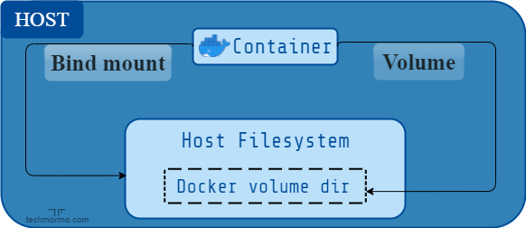

# **Docker Volumes**

In Docker, volumes are a way to persist and share data between different containers and the host system itself. A volume is a directory or a file in the host filesystem that is mounted into a container.

## **Why Use Volumes**

<u>**Data Persistence**</u>: Volumes allow you to store data outside of the container's filesystem, which means that the data will persist even if the container is deleted or recreated.

<u>**Sharing Data Between Containers**</u>: Volumes can be shared between multiple containers, which makes it easy to build complex applications that require multiple services.

<u>**Sharing Data Between Host and Container**</u>: Volumes can also be used to share data between the host system and a container, which is useful for development and debugging.

#
# Bind Mounts - Older Version Of Volumes

Bind Mounts allow you to mount a specific directory or file from the host system directly into a container. 

Unlike Volumes, which are managed by Docker and stored within the Docker environment, Bind Mounts provide a **`direct link`** between the host filesystem and the container.

</img>

#
Here's a table highlighting the differences between Volumes and Bind Mounts in Docker:

<table>
  <tr>
    <th></th>
    <th>Volumes</th>
    <th>Bind Mounts</th>
  </tr>
  <tr>
    <td>Management</td>
    <td>Managed by Docker</td>
    <td>Managed by the host system</td>
  </tr>
  <tr>
    <td>Persistence</td>
    <td>Independent of the Docker cli commands</td>
    <td>Dependent on the host filesystem</td>
  </tr>
  <tr>
    <td>Location</td>
    <td>Stored within the Docker environment</td>
    <td>Linked directly to host directories</td>
  </tr>
  <tr>
    <td>Creation</td>
    <td>Created using Docker commands</td>
    <td>Pre-existing directories or files</td>
  </tr>
  <tr>
    <td>Sharing</td>
    <td>Can be shared between containers</td>
    <td>Can be shared between containers and host system</td>
  </tr>
  <tr>
    <td>Access</td>
    <td>Defined by Docker container configuration</td>
    <td>Direct access to host filesystem</td>
  </tr>
  <tr>
    <td>Real-Time Updates</td>
    <td>Changes propagate across container restarts</td>
    <td>Immediate synchronization with host filesystem</td>
  </tr>
  <tr>
    <td>Compatibility</td>
    <td>Easily portable between Docker environments</td>
    <td>Dependent on host directory structure</td>
  </tr>
  <tr>
    <td>Permissions</td>
    <td>Docker manages file permissions</td>
    <td>Inherits permissions from host system</td>
  </tr>
  <tr>
    <td>Docker CLI Commands</td>
    <td>docker volume create, docker volume ls, docker volume rm</td>
    <td>-</td>
  </tr>
</table>

#
[Back](./4.%20networks.md) | [Next](../2.%20Practice/1.%20docker-lifecycle.md)