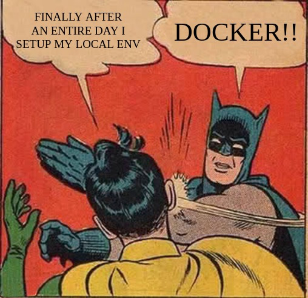

# Practicing the Docker Lifecycle with a NGINX docker image
</img>

In this exercise, we will practice the Docker lifecycle by pulling the latest version of the Nginx image and running it in a container with specific requirements. 

**`Please note`**, all commands are provided at your service in the [basic commands.md](../3.%20Commands/1.%20basic%20commands.md)

Here are the steps to follow:

1. **Pull the latest version of Nginx:** The first step is to pull the **`latest`** version of the Nginx image from Docker Hub. This can be done using the appropriate Docker command. Make sure you have a stable internet connection before executing this command.

2. **Run the Nginx container with the following requirements:** Once you have pulled the Nginx image, the next step is to run it in a container with specific requirements. Here are the requirements:

   - The container should run on a **`bridge`** network mode.
   
   - **`Port`** 80 inside the container should be exposed to port 8080 on the host machine.

   - The container should have a **`name`** of "mynginx".

   - The container should be run in **`detached mode`** so that it continues running in the background.

   You can achieve these requirements by using the appropriate Docker command with the necessary flags.

3. **Check running containers:** Before testing the Nginx container, you can check **`the list of currently running Docker containers`** on your machine. You can do this using the appropriate Docker command with the necessary flags.

4. **Test the Nginx container:** After running the Nginx container with the required configuration, you can test it by opening a web browser and navigating to **`http://localhost:8080`**. If everything is configured correctly, you should see the default Nginx web page.

5. **`Stop` and `remove` the Nginx container:** Once you have tested the Nginx container, you can stop and remove it using the appropriate Docker commands. to do this, you will need to specify the **`name`** of the container that you created in step 2. This will remove the container from your machine and free up any resources it was using.

By following these steps, you will have practiced several important Docker lifecycle tasks, including pulling an image from Docker Hub, running a container with specific requirements, testing the container, and stopping and removing the container.

#
[Back](../1.%20Introduction/5.%20volumes.md) | [Next](./2.%20docker-build.md)